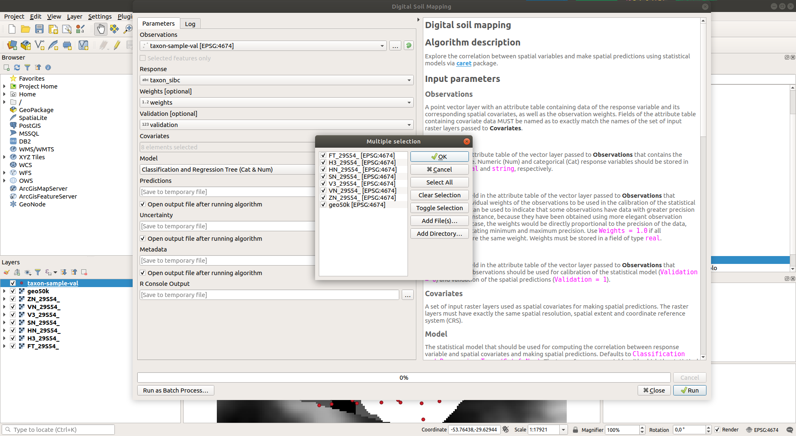

# Spatial modelling via QGIS-R integration 

## Installation

You can find the R scripts for spatial modelling in the `rscripts` folder.

Every R script is composed of two files: a `*.rsx` file with the R code and a `*.rsx.help` file with instructions on how to use the R script.

To use an R script, you must save both `*.rsx` and `*.rsx.help` files in your local QGIS `rscripts` folder. On Linux machines, this generally is located at:

```
/home/<your-name-here>/.local/share/QGIS/QGIS3/profiles/default/processing/rscripts
```

On Windows machines, the QGIS `rscripts` folder is generally located at:

```
C:/Users/<your-name-here>/.qgis/processing/rscripts
```

## Usage




## More info

* [Processing R Provider](https://north-road.github.io/qgis-processing-r/)

* [Writing new Processing algorithms as python scripts](https://docs.qgis.org/2.18/en/docs/user_manual/processing/scripts.html)

* [Creating R scripts](https://docs.qgis.org/2.18/en/docs/user_manual/processing/3rdParty.html#r-creating-r-scripts)

* [Use R scripts in Processing](https://docs.qgis.org/2.18/en/docs/training_manual/processing/r_intro.html)

* [R Syntax in Processing scripts](https://docs.qgis.org/2.18/en/docs/training_manual/processing/r_syntax.html#r-syntax)
